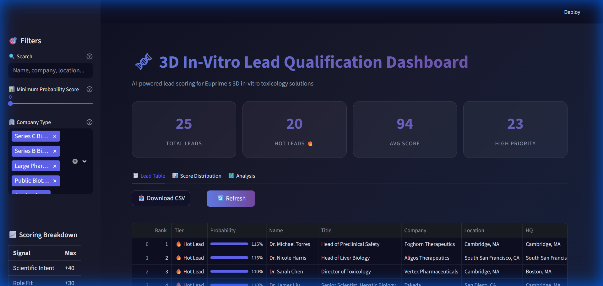
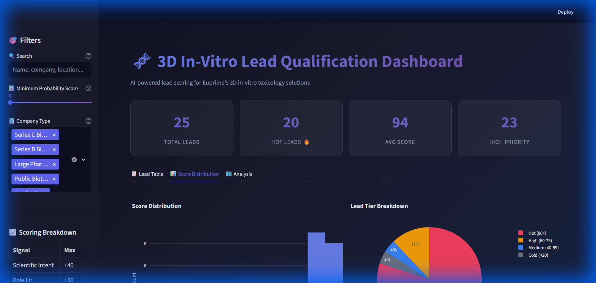
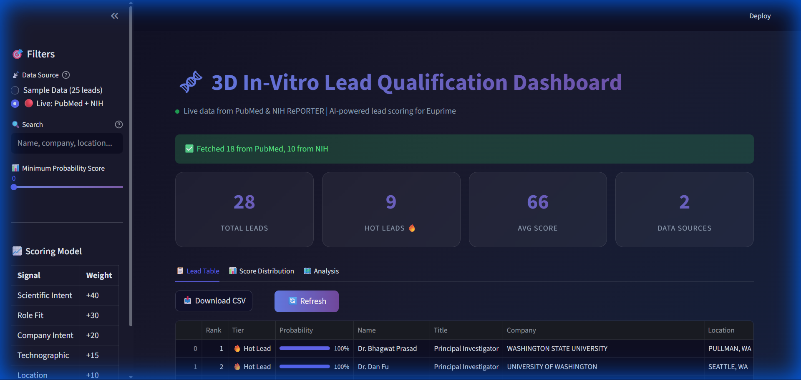

# 🧬 BioLeads AI - Lead Scoring Agent

<div align="center">

**AI-powered lead qualification for 3D in-vitro toxicology solutions**

[](https://python.org)
[](https://streamlit.io)
[](LICENSE)

[Demo](#-screenshots) • [Features](#-features) • [Installation](#-installation) • [Usage](#-usage) • [API](#-data-sources)

</div>

---

## 📸 Screenshots

### Main Dashboard


*Premium glassmorphism UI with real-time metrics and lead scoring*

### Score Distribution & Analytics


*Interactive Plotly charts showing score distribution and tier breakdown*

### Live Data Fetching


*Real-time data from PubMed and NIH RePORTER APIs (free!)*

### Company Analysis


*Company type and location analytics for strategic targeting*

---

## 🎯 What It Does

BioLeads AI is a web agent that crawls multiple data sources to **identify, enrich, and rank leads** who are most likely to need 3D in-vitro models for drug toxicology studies.

### The Problem

The biotech BD team wastes hours manually searching:
- LinkedIn for toxicology directors
- PubMed for DILI researchers  
- Crunchbase for funded startups
- Conference sites for attendees

### The Solution

BioLeads AI automates this with a **3-stage pipeline**:

```
┌─────────────────┐    ┌─────────────────┐    ┌─────────────────┐
│  IDENTIFICATION │ → │   ENRICHMENT    │ → │    RANKING      │
│                 │    │                 │    │                 │
│  • PubMed       │    │  • Location     │    │  • 5-signal     │
│  • NIH Grants   │    │  • Company HQ   │    │    scoring      │
│  • Conferences  │    │  • Funding      │    │  • 0-100 score  │
│  • Funding News │    │  • Tech stack   │    │  • Priority     │
└─────────────────┘    └─────────────────┘    └─────────────────┘
```

---

## ✨ Features

### 🔍 Multi-Source Intelligence
- **PubMed** - Recent DILI/hepatotoxicity paper authors
- **NIH RePORTER** - Active grant principal investigators
- **Conferences** - SOT, AACR speaker/attendee lists
- **Funding News** - Series A/B biotech announcements

### 📊 5-Dimensional Scoring Model

| Signal | Weight | What It Measures |
|--------|--------|------------------|
| **Scientific Intent** | +40 | Published DILI/hepatic paper in last 2 years |
| **Role Fit** | +30 | Title: Director, VP, Head of Toxicology/Safety |
| **Company Intent** | +20 | Series A/B funding (budget available) |
| **Technographic** | +15 | Already uses in-vitro models or NAMs |
| **Location** | +10 | Hub city: Boston, Basel, Bay Area, UK |

**Score Examples:**
- 👤 Junior Scientist at unfunded startup → **15/100** ❄️
- 👤 Director of Safety at Series B biotech in Cambridge with DILI paper → **95/100** 🔥

### 🎨 Premium UI
- Dark mode with glassmorphism design
- Interactive Plotly charts
- Real-time metric cards
- One-click CSV export
- Mobile responsive

### ⚡ Live Data Toggle
Switch between:
- **Sample Data** - 25 curated demo leads (instant)
- **Live Mode** - Real-time PubMed + NIH fetching

---

## 🚀 Installation

### Prerequisites
- Python 3.8 or higher
- pip package manager

### Quick Start

```bash
# Clone the repository
git clone https://github.com/YOUR_USERNAME/bioleads-ai.git
cd bioleads-ai

# Create virtual environment (recommended)
python -m venv venv
source venv/bin/activate  # On Windows: venv\Scripts\activate

# Install dependencies
pip install -r requirements.txt

# Run the dashboard
python -m streamlit run streamlit_app.py
```

The dashboard opens at **http://localhost:8501** 🚀

---

## 💻 Usage

### Running the Dashboard

```bash
python -m streamlit run streamlit_app.py
```

### Running the Pipeline (CLI)

```bash
# Full pipeline run
python main.py

# Test mode with sample data
python main.py --test-run
```

### Dashboard Controls

| Control | Action |
|---------|--------|
| 📡 Data Source | Toggle between sample and live data |
| 🔍 Search | Filter by name, company, or location |
| 📊 Score Slider | Set minimum probability threshold |
| 📥 Download CSV | Export filtered leads for CRM import |
| 🔄 Refresh | Clear cache and fetch fresh data |

---

## 📡 Data Sources

All APIs are **completely FREE**:

| Source | API | Rate Limit | Auth Required |
|--------|-----|------------|---------------|
| **PubMed** | NCBI E-utilities | 3/sec | ❌ No |
| **NIH RePORTER** | NIH API | Unlimited | ❌ No |
| **RSS Feeds** | Various | Unlimited | ❌ No |

### How Live Fetching Works

1. **PubMed**: Searches for recent papers with keywords like "DILI", "drug-induced liver injury", "hepatotoxicity", "3D liver model"
2. **NIH RePORTER**: Queries active grants related to liver toxicology and 3D models
3. **Scoring**: Each lead is scored using the 5-signal model
4. **Display**: Results are ranked and displayed in the interactive table

---

## 📁 Project Structure

```
bioleads-ai/
├── 📄 streamlit_app.py      # Main dashboard (Streamlit)
├── 📄 main.py               # Pipeline orchestrator
├── 📄 requirements.txt      # Python dependencies
├── 📄 README.md             # This file
│
├── 📂 app/
│   ├── 📂 sources/          # Data crawlers
│   │   ├── pubmed_crawler.py
│   │   ├── crunchbase_crawler.py
│   │   ├── conference_crawler.py
│   │   └── grants_crawler.py
│   │
│   └── 📂 scoring/
│       └── probability_engine.py
│
├── 📂 data/
│   └── sample_leads.json    # 25 demo leads
│
├── 📂 assets/               # Screenshots
│
└── 📂 .streamlit/
    └── config.toml          # Dark theme config
```

---

## ☁️ Deployment

### Streamlit Community Cloud (Free)

1. **Push to GitHub**
```bash
git init
git add .
git commit -m "BioLeads AI - Lead Scoring Agent"
git branch -M main
git remote add origin https://github.com/YOUR_USERNAME/bioleads-ai.git
git push -u origin main
```

2. **Deploy**
   - Go to [share.streamlit.io](https://share.streamlit.io)
   - Connect your GitHub account
   - Select the repository
   - Set main file: `streamlit_app.py`
   - Click **Deploy**

3. **Share** your live URL!

---

## 🛠️ Tech Stack

| Layer | Technology |
|-------|------------|
| **Frontend** | Streamlit |
| **Visualization** | Plotly |
| **Data Processing** | Pandas |
| **HTTP Client** | Requests |
| **Web Scraping** | BeautifulSoup4 |
| **Styling** | Custom CSS (Glassmorphism) |

---

## 🤝 Contributing

Contributions are welcome! Please feel free to submit a Pull Request.

1. Fork the repository
2. Create your feature branch (`git checkout -b feature/AmazingFeature`)
3. Commit your changes (`git commit -m 'Add some AmazingFeature'`)
4. Push to the branch (`git push origin feature/AmazingFeature`)
5. Open a Pull Request

---

## 📄 License

This project is licensed under the MIT License - see the [LICENSE](LICENSE) file for details.

---

<div align="center">

**Built with ❤️ using Python and Streamlit**

⭐ Star this repo if you find it useful!

</div>
