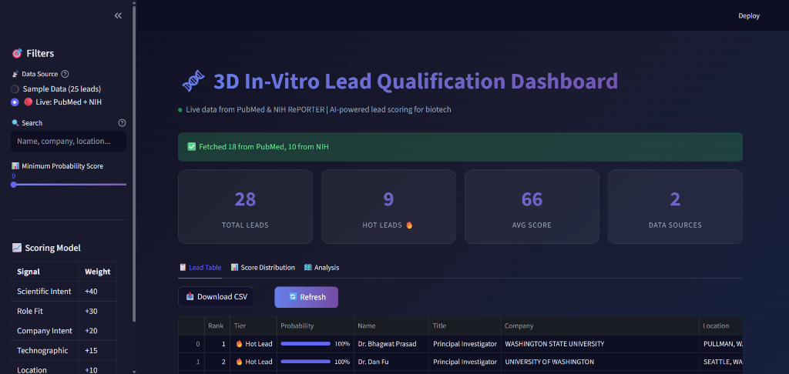
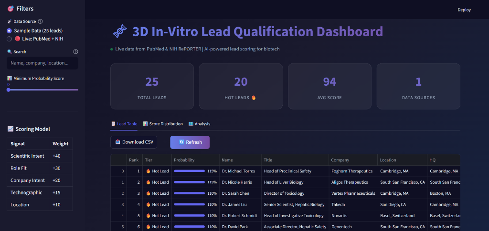
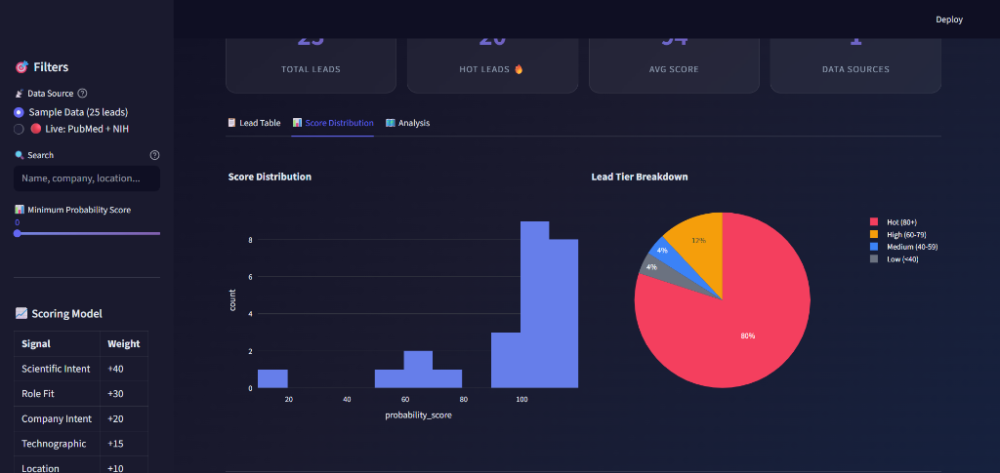
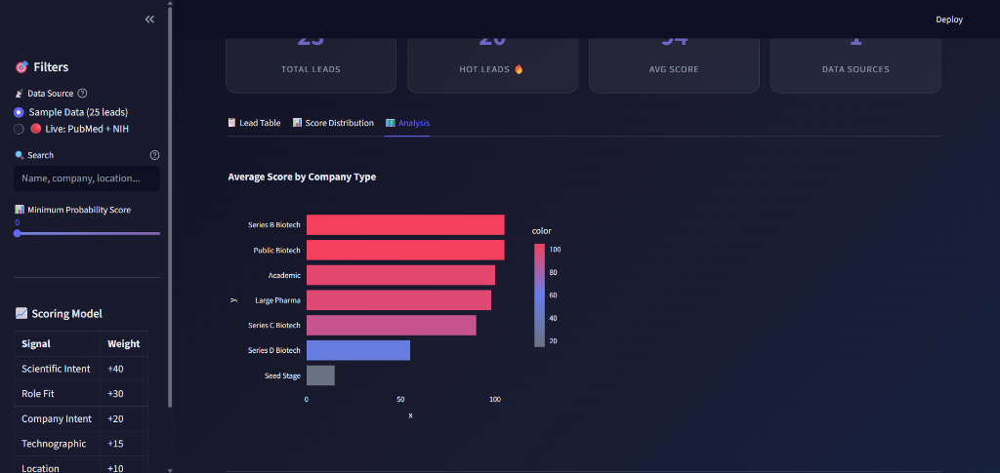

# 🧬 BioLeads AI - Lead Scoring Agent

<div align="center">

**AI-powered lead qualification for 3D in-vitro toxicology solutions**

[](https://python.org)
[](https://streamlit.io)
[](LICENSE)

[Demo](#-screenshots) • [Features](#-features) • [Installation](#-installation) • [Usage](#-usage) • [API](#-data-sources)

</div>

---

## � Overview

**BioLeads AI** is an **AI-powered lead qualification tool** designed specifically for the biotech industry. It helps Business Development (BD) teams identify high-potential leads who are likely to need **3D in-vitro models for drug toxicology studies**.

---

## 🎯 The Problem It Solves

Biotech BD teams waste hours manually searching across multiple platforms:
- 🔍 LinkedIn for toxicology directors
- 📚 PubMed for DILI (Drug-Induced Liver Injury) researchers
- 💰 Crunchbase for funded startups
- 🎤 Conference sites for attendees

**BioLeads AI automates this entire process!**

---

## �📸 Screenshots

### 🔴 Live Data Mode - Real-time PubMed & NIH Data


*Real-time data fetching from PubMed and NIH RePORTER APIs - completely FREE!*

---

### 📊 Sample Data Mode - Curated Demo Leads


*Premium glassmorphism UI with 25 curated demo leads and scoring model visualization*

---

### 📈 Score Distribution & Tier Breakdown


*Interactive Plotly charts showing probability score distribution and lead tier breakdown (Hot, High, Medium, Low)*

---

### 🏢 Company Analysis


*Average score by company type - identifying Series B biotechs as highest-value targets*

---

## ⚙️ How It Works - 3-Stage Pipeline

BioLeads AI uses a sophisticated **3-stage pipeline** to identify, enrich, and rank leads:

```
┌─────────────────────────────────────────────────────────────────────────────────────────┐
│                           🧬 BIOLEADS AI PIPELINE                                       │
└─────────────────────────────────────────────────────────────────────────────────────────┘

     ┌──────────────────────┐        ┌──────────────────────┐        ┌──────────────────────┐
     │                      │        │                      │        │                      │
     │   📥 IDENTIFICATION  │        │   🔬 ENRICHMENT      │        │   📊 RANKING         │
     │                      │        │                      │        │                      │
     │  ┌────────────────┐  │        │  ┌────────────────┐  │        │  ┌────────────────┐  │
     │  │   PubMed API   │  │        │  │   Location     │  │        │  │  5-Signal      │  │
     │  │   ───────────  │  │        │  │   ─────────    │  │        │  │  Scoring       │  │
     │  │  DILI Papers   │  │   ──►  │  │  Hub cities    │  │   ──►  │  │  ─────────     │  │
     │  │  Hepatotoxicity│  │        │  │  (Boston, etc) │  │        │  │  0-100 score   │  │
     │  └────────────────┘  │        │  └────────────────┘  │        │  └────────────────┘  │
     │                      │        │                      │        │                      │
     │  ┌────────────────┐  │        │  ┌────────────────┐  │        │  ┌────────────────┐  │
     │  │  NIH RePORTER  │  │        │  │  Company Info  │  │        │  │  Tier Labels   │  │
     │  │  ─────────────  │  │        │  │  ────────────  │  │        │  │  ───────────   │  │
     │  │  Active Grants │  │        │  │  HQ Location   │  │        │  │  🔥 Hot (80+)  │  │
     │  │  Liver Tox     │  │        │  │  Company Type  │  │        │  │  ⚡ High (60+) │  │
     │  └────────────────┘  │        │  └────────────────┘  │        │  │  📊 Medium     │  │
     │                      │        │                      │        │  │  ❄️ Low (<40)  │  │
     │  ┌────────────────┐  │        │  ┌────────────────┐  │        │  └────────────────┘  │
     │  │  Conferences   │  │        │  │   Funding      │  │        │                      │
     │  │  ─────────────  │  │        │  │  ─────────    │  │        │  ┌────────────────┐  │
     │  │  SOT, AACR     │  │        │  │  Series A/B/C │  │        │  │   Priority     │  │
     │  │  Speakers      │  │        │  │  NIH Grants   │  │        │  │   Ranking      │  │
     │  └────────────────┘  │        │  └────────────────┘  │        │  │  ───────────   │  │
     │                      │        │                      │        │  │  1, 2, 3...    │  │
     │  ┌────────────────┐  │        │  ┌────────────────┐  │        │  └────────────────┘  │
     │  │  Funding News  │  │        │  │  Tech Stack   │  │        │                      │
     │  │  ─────────────  │  │        │  │  ───────────  │  │        │                      │
     │  │  Series A/B    │  │        │  │  In-vitro     │  │        │                      │
     │  │  Announcements │  │        │  │  models used? │  │        │                      │
     │  └────────────────┘  │        │  └────────────────┘  │        │                      │
     │                      │        │                      │        │                      │
     └──────────────────────┘        └──────────────────────┘        └──────────────────────┘
              │                              │                               │
              │                              │                               │
              ▼                              ▼                               ▼
     ┌──────────────────────────────────────────────────────────────────────────────────────┐
     │                                                                                      │
     │                         📊 STREAMLIT DASHBOARD OUTPUT                                │
     │                                                                                      │
     │   ┌─────────────┐    ┌─────────────┐    ┌─────────────┐    ┌─────────────┐          │
     │   │   28        │    │    9        │    │    66       │    │    2        │          │
     │   │   TOTAL     │    │   HOT       │    │   AVG       │    │   DATA      │          │
     │   │   LEADS     │    │   LEADS �  │    │   SCORE     │    │   SOURCES   │          │
     │   └─────────────┘    └─────────────┘    └─────────────┘    └─────────────┘          │
     │                                                                                      │
     │   ┌────────────────────────────────────────────────────────────────────────────┐    │
     │   │  Lead Table  │  Score Distribution  │  Analysis                            │    │
     │   │  ──────────────────────────────────────────────────────────────────────    │    │
     │   │  Rank │ Tier     │ Score │ Name        │ Title           │ Company        │    │
     │   │  1    │ 🔥 Hot   │ 100%  │ Dr. Torres  │ Head of Preclin │ Foghorn Ther.  │    │
     │   │  2    │ 🔥 Hot   │ 115%  │ Dr. Harris  │ Head of Liver   │ Aligos Ther.   │    │
     │   └────────────────────────────────────────────────────────────────────────────┘    │
     │                                                                                      │
     │   📥 Download CSV    🔄 Refresh                                                      │
     │                                                                                      │
     └──────────────────────────────────────────────────────────────────────────────────────┘
```

---

## 📊 5-Dimensional Scoring Model

Each lead is scored on **5 signals** out of 100 points:

| Signal | Weight | What It Measures |
|--------|--------|------------------|
| **🔬 Scientific Intent** | +40 | Published DILI/hepatic paper in last 2 years |
| **👔 Role Fit** | +30 | Title: Director, VP, Head of Toxicology/Safety |
| **💰 Company Intent** | +20 | Series A/B funding (budget available) |
| **🧪 Technographic** | +15 | Already uses in-vitro models or NAMs |
| **📍 Location** | +10 | Hub city: Boston, Basel, Bay Area, UK |

### Score Examples

| Lead Profile | Score | Tier |
|--------------|-------|------|
| 👤 Junior Scientist at unfunded startup | **15/100** | ❄️ Low |
| 👤 Research Author with DILI paper | **55/100** | 📊 Medium |
| 👤 Director of Toxicology at Series A biotech | **70/100** | ⚡ High |
| 👤 Director of Safety at Series B biotech in Cambridge with DILI paper | **95/100** | 🔥 Hot |

---

## ✨ Features

### 🔍 Multi-Source Intelligence
- **PubMed** - Recent DILI/hepatotoxicity paper authors
- **NIH RePORTER** - Active grant principal investigators
- **Conferences** - SOT, AACR speaker/attendee lists
- **Funding News** - Series A/B biotech announcements

### 🎨 Premium UI
- Dark mode with glassmorphism design
- Interactive Plotly charts
- Real-time metric cards
- One-click CSV export
- Mobile responsive

### ⚡ Live Data Toggle
Switch between:
- **Sample Data** - 25 curated demo leads (instant)
- **Live Mode** - Real-time PubMed + NIH fetching

---

## 🚀 Installation

### Prerequisites
- Python 3.8 or higher
- pip package manager

### Quick Start

```bash
# Clone the repository
git clone https://github.com/YOUR_USERNAME/bioleads-ai.git
cd bioleads-ai

# Create virtual environment (recommended)
python -m venv venv
source venv/bin/activate  # On Windows: venv\Scripts\activate

# Install dependencies
pip install -r requirements.txt

# Run the dashboard
python -m streamlit run streamlit_app.py
```

The dashboard opens at **http://localhost:8501** 🚀

---

## 💻 Usage

### Running the Dashboard

```bash
python -m streamlit run streamlit_app.py
```

### Running the Pipeline (CLI)

```bash
# Full pipeline run
python main.py

# Test mode with sample data
python main.py --test-run
```

### Dashboard Controls

| Control | Action |
|---------|--------|
| 📡 Data Source | Toggle between sample and live data |
| 🔍 Search | Filter by name, company, or location |
| 📊 Score Slider | Set minimum probability threshold |
| 📥 Download CSV | Export filtered leads for CRM import |
| 🔄 Refresh | Clear cache and fetch fresh data |

---

## 📡 Data Sources

All APIs are **completely FREE**:

| Source | API | Rate Limit | Auth Required |
|--------|-----|------------|---------------|
| **PubMed** | NCBI E-utilities | 3/sec | ❌ No |
| **NIH RePORTER** | NIH API | Unlimited | ❌ No |
| **RSS Feeds** | Various | Unlimited | ❌ No |

### How Live Fetching Works

1. **PubMed**: Searches for recent papers with keywords like "DILI", "drug-induced liver injury", "hepatotoxicity", "3D liver model"
2. **NIH RePORTER**: Queries active grants related to liver toxicology and 3D models
3. **Scoring**: Each lead is scored using the 5-signal model
4. **Display**: Results are ranked and displayed in the interactive table

---

## 📁 Project Structure

```
bioleads-ai/
├── 📄 streamlit_app.py      # Main dashboard (Streamlit)
├── 📄 main.py               # Pipeline orchestrator
├── 📄 requirements.txt      # Python dependencies
├── 📄 README.md             # This file
│
├── 📂 app/
│   ├── 📂 sources/          # Data crawlers
│   │   ├── pubmed_crawler.py
│   │   ├── crunchbase_crawler.py
│   │   ├── conference_crawler.py
│   │   └── grants_crawler.py
│   │
│   └── 📂 scoring/
│       └── probability_engine.py
│
├── 📂 data/
│   ├── sample_leads.json    # 25 demo leads
│   └── scored_leads.json    # Pipeline output
│
├── 📂 assets/               # Screenshots
│   ├── dashboard_live.png
│   ├── dashboard_sample.png
│   ├── score_distribution.png
│   └── analysis.png
│
└── 📂 .streamlit/
    └── config.toml          # Dark theme config
```

---

## 🔄 Running Modes

| Mode | Command | Description |
|------|---------|-------------|
| **Dashboard** | `python -m streamlit run streamlit_app.py` | Interactive web UI with live data |
| **CLI Pipeline** | `python main.py` | Batch processing, saves to `scored_leads.json` |
| **Test Mode** | `python main.py --test-run` | Uses sample data only |

---

## ☁️ Deployment

### Streamlit Community Cloud (Free)

1. **Push to GitHub**
```bash
git init
git add .
git commit -m "BioLeads AI - Lead Scoring Agent"
git branch -M main
git remote add origin https://github.com/YOUR_USERNAME/bioleads-ai.git
git push -u origin main
```

2. **Deploy**
   - Go to [share.streamlit.io](https://share.streamlit.io)
   - Connect your GitHub account
   - Select the repository
   - Set main file: `streamlit_app.py`
   - Click **Deploy**

3. **Share** your live URL!

---

## 🛠️ Tech Stack

| Layer | Technology |
|-------|------------|
| **Frontend** | Streamlit |
| **Visualization** | Plotly |
| **Data Processing** | Pandas |
| **HTTP Client** | Requests |
| **Web Scraping** | BeautifulSoup4 |
| **Styling** | Custom CSS (Glassmorphism) |

---

## 🤝 Contributing

Contributions are welcome! Please feel free to submit a Pull Request.

1. Fork the repository
2. Create your feature branch (`git checkout -b feature/AmazingFeature`)
3. Commit your changes (`git commit -m 'Add some AmazingFeature'`)
4. Push to the branch (`git push origin feature/AmazingFeature`)
5. Open a Pull Request

---

## 📄 License

This project is licensed under the MIT License - see the [LICENSE](LICENSE) file for details.

---

<div align="center">

**Built with ❤️ using Python and Streamlit**

⭐ Star this repo if you find it useful!

</div>
